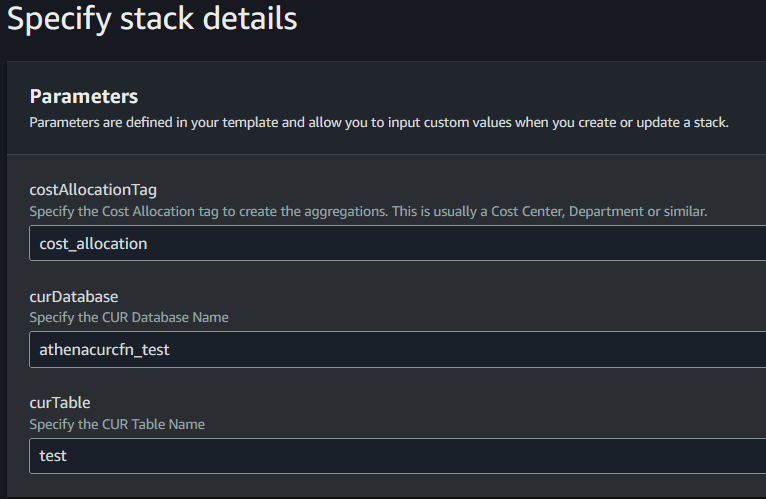
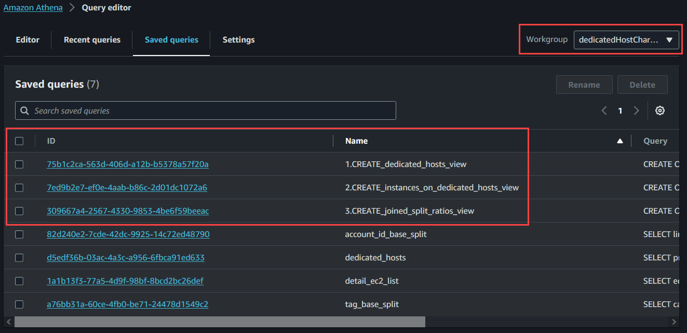
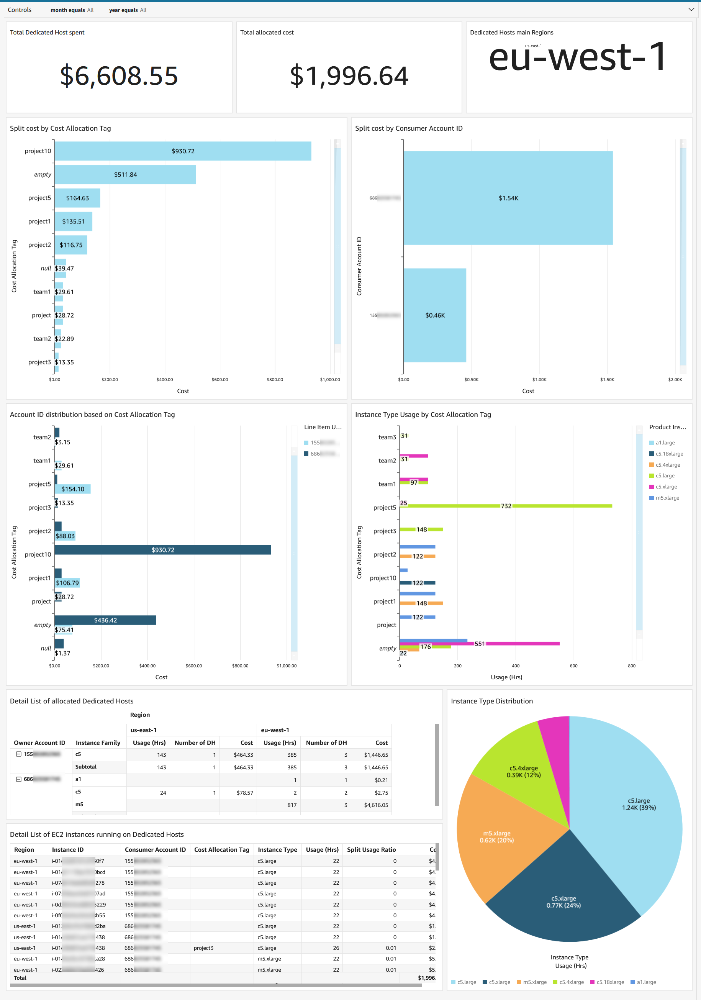
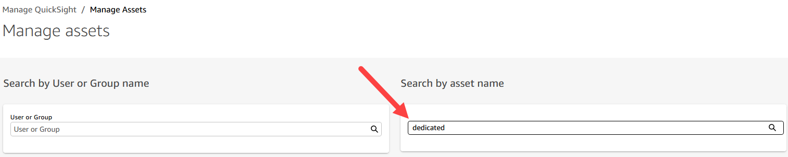
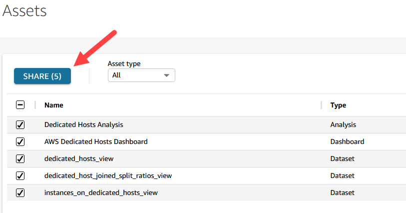

# IT Chargeback report for Instances running on Dedicated Hosts

## Description
This reference solution aims to solve the cost allocation of EC2 instances running on top of Amazon EC2 Dedicated Hosts by using the AWS Cost and Usage Reports (CUR) data, plus some Athena SQL queries and an optional QuickSight analysis for visualization. We do this by using different common attributes for cost aggregation, such as Cost Allocation Tags and Account IDs.

## Athena implementation

Following is a step by step guide on how to create the necessary views on top of CUR:

1. Pre-requisites: 
    1. A user-defined Cost Allocation Tags also needs to be enabled, follow this instructions to enable oneif you don’t have it yet.
    2. CUR data needs to be available. You can use a pre-created CUR report or create a new one if you don’t have one already. Follow the instructions detailed here to do so. After you create your report, it can take up to 24 hours for AWS to deliver the first report to your Amazon S3 bucket.
2. Deploy the following CloudFormation template [cf-Athena-preparation](cloudformation/cf-Athena-preparation.yaml), it will create an S3 Bucket, an Athena Workgroup and a few Saved Queries for you to use later. There are 3 parameters to be configured on the CloudFormation execution curDatabase, curTable and costAllocationTag. 

3. Now go to the Athena Service, change the Workgroup and execute the 3 Saved Queries in the right other, according to it’s name. This will create the 3 views needed for the analysis.
    1.  1.CREATE_dedicated_hosts_view: Creates a View with filtered information for all the Dedicated Hosts running in the Organization. Adds some important information like number of hours running, or number of hosts.
    2.  2.CREATE_instances_on_dedicated_hosts_view: Creates a View with filtered information for all EC2 instances running on top of Dedicated Hosts.
    3.  3.CREATE_joined_split_ratios_view: Joins the data from the previous two tables, calculating 2 key new values, split_ratio and split_cost. This table already shows the cost allocation for each EC2 instance.

Now that the Views are available you can directly consume the data from those, most importantly the View called dh_joined_split_ratios_view. Optionally you can test some of the Sample Queries created, to find if the information is gathered correctly.

## QuickSight Visualizations

As part of the reference solution, we also created an initial example QuickSight Dashboard that you can easily implement. You can also connect your BI Tools of choice directly into Athena, to execute queries and create dashboards with the information available.

## Quicksight implementation

Following is a step by step guide on how to create the necessary views on top of CUR:

1. Pre-requisites:
    1. You can use an existing QuickSight instance or create a new one, you can follow this guide to create it (either Standard or Enterprise will work).
2. Once your instance is ready, you need to assign permissions to the IAM Role used by QuickSight to use Athena and S3, you can use this guide and assign the following permissions:
    1. Amazon Athena Access
    2. S3 read access to the CUR Bucket
    3. S3 read and write access to the Athena results bucket, named: dedicated-host-chargeback-{accountID} 
3. Download and deploy the following CloudFormation template [cf-QuickSight-Assets.json](cloudformation/cf-QuickSight-Assets.json). 
4. Once the process is finished, you now need to assign permissions to the assets in QuickSight, you can follow this instructions. 
5. Once you are in the “Manage Assets” console, you can filter using the “Search by asset name” box for “dedicated”

6. Finally select all the assets and Share those with the desired administrator user.

Now you can go back to the QuickSight user console and select the newly deployed Dashboad for visualization. The dashboard includes a number of pre-defined analysis that you can filter based on Month and Year, if you need to change or add some additional information, feel free to do so through the Analysis and then republishing the dashboard.

## Notes

* The solution will not impact your current billing data, so the split will not be available in Cost Explorer or Cost and Usage Report.
* Our EC2 service has a billing granularity per second, but this solution’s granularity is hourly. That means that if the instance was on for a couple of seconds, it will count as a full hour on the report.
* Untagged instances running on top of Dedicated Hosts will show as “Empty“ on the split by Tag report. If the team owning the instance tag the resource mid Month, it doesn’t backfill the information into CUR. This means that the report will show half month of cost allocation to the team, and half month to the ”Empty” category.

## Security
See [CONTRIBUTING](CONTRIBUTING.md) for more information.

## License
This library is licensed under the MIT-0 License. See the LICENSE file.